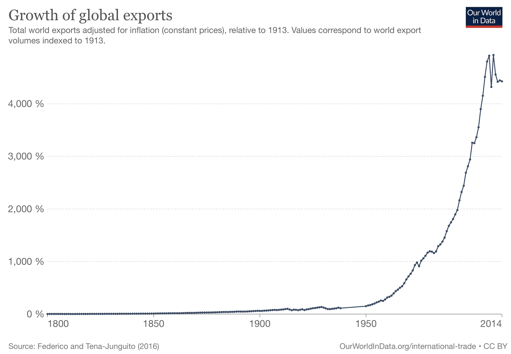
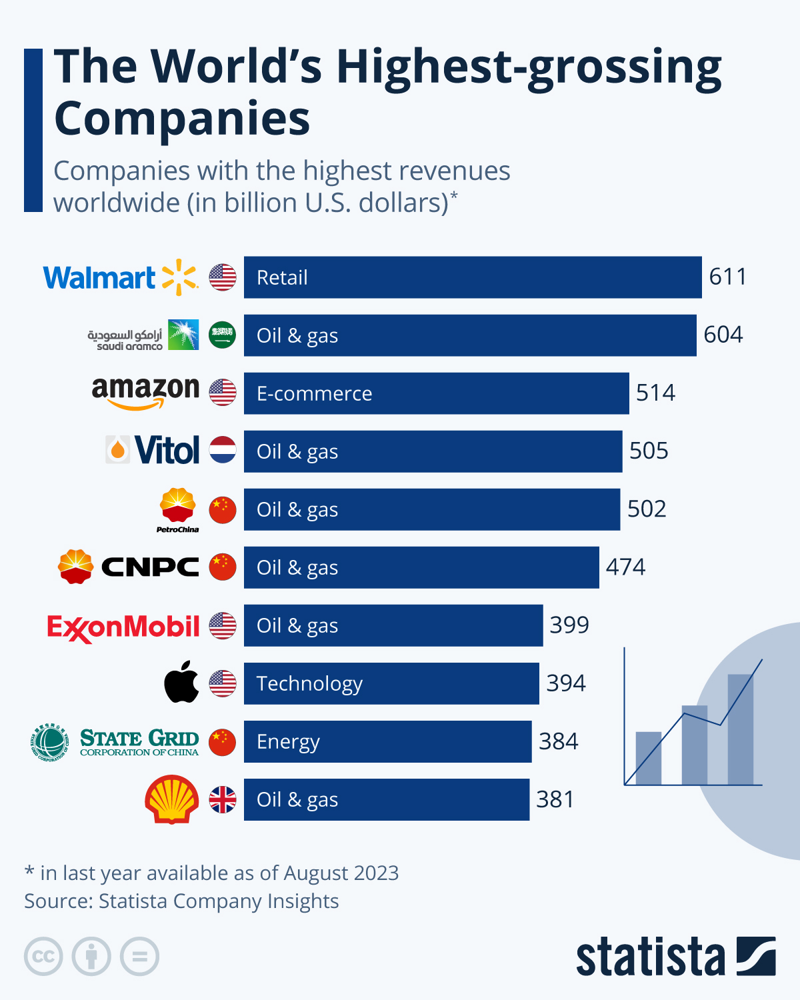
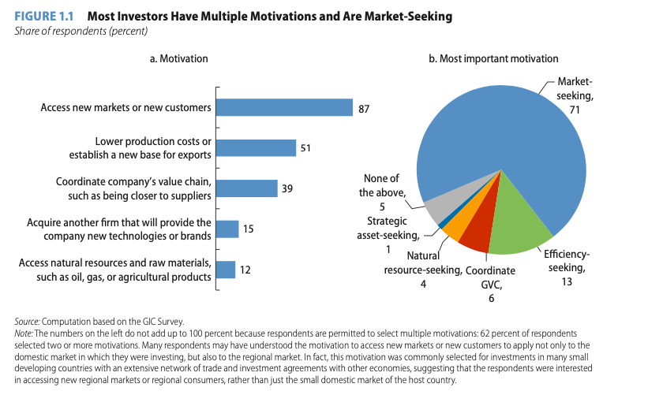

## Today's Plan

::: {.callout-important icon=false title="Today's Big Question"}
**Who has power in global business — governments, firms, or society — and when, why, and to what effect? Watch for this question all semester.**
:::

<table class="plan-table">
<thead><tr><th>Section</th><th>What we'll cover</th></tr></thead>
<tbody>
<tr><td class="sec">1 · Framing the semester</td><td>The power question that runs through every case</td></tr>
<tr><td class="sec">2 · Stylized facts</td><td>How big, integrated, and concentrated the global economy is</td></tr>
<tr><td class="sec">3 · Why firms go abroad</td><td>Motives, entry modes, and the liability of foreignness</td></tr>
<tr><td class="sec">4 · Three ways of seeing</td><td>Liberal, nationalist, and critical lenses — plus Ruggie's PAA</td></tr>
<tr><td class="sec">5 · Why countries want FDI in</td><td>The case for it, the counterpoint, and what the evidence shows</td></tr>
</tbody>
</table>

# Framing the semester {background-color="#990000"}

## The question underneath every case

::: {.columns}
::: {.column width="60%"}
Every case this semester asks a version of the same question:

**Who has power in this relationship — the government, the firm, or society (consumers, activists, workers) — and what lets them exercise it?**

Sometimes these actors fight each other for power. Sometimes they coordinate. Watch for both, all term.
:::
::: {.column width="40%"}
::: {.fragment}
**Today's actors:**

- Firms deciding whether to invest abroad
- Governments competing to attract them
- The bargain each side strikes — and who gets the better end of it
:::
:::
:::

# Stylized facts {background-color="#990000"}

## A vast, integrated economy

::: {.columns}
::: {.column width="46%"}
- Trade is a major driver of global output, and **FDI drives trade**
- MNEs grew from ~7,000 (1970) to **over 100,000** (2011), with ~900,000 affiliates
- By 2016: ~**36% of global output, ⅔ of exports, ½ of imports**

::: {.fragment}
These firms aren't a niche — they *are* the global economy, which is exactly why the power question matters.
:::
:::
::: {.column width="54%"}
{fig-alt="BCG map of global trade flows" width="100%"}

[Source: BCG, "Redrawing the Map of Global Trade"]{.cite}
:::
:::

## Concentrated value

::: {.columns}
::: {.column width="56%"}
- The world's **most valuable firms are global** firms
- Economic activity is **geographically concentrated** — a few regions and companies hold an outsized share
:::
::: {.column width="44%"}
{fig-alt="The world's most valuable companies" width="90%"}
:::
:::

# Why firms go abroad {background-color="#990000"}

## Four motives

::: {.columns}
::: {.column width="48%"}
- **Resource-seeking** — raw materials, labor, inputs
- **Market-seeking** — sell into a new market
- **Efficiency-seeking** — lower costs by relocating
- **Export platforming** — produce in one place to export elsewhere
:::
::: {.column width="52%"}
{fig-alt="Survey of investor motivations — most are market-seeking" width="100%"}

[Source: World Bank GIC survey]{.cite}
:::
:::

## How firms enter a market

::: {.columns}
::: {.column width="50%"}
**Non-equity (asset-lite)**

- Exporting / importing
- Licensing (rent your IP)
- Franchising (rent your brand)
- Long-term subcontracting
:::
::: {.column width="50%"}
**Equity (FDI)**

- **Horizontal** — replicate production abroad to capture a local market or for regulatory arbitrage
- **Vertical** — fragment the value chain across locations, placing each stage where it's cheapest or most advantageous
:::
:::

**Liability of foreignness** makes FDI costly, so firms prefer asset-lite modes *unless* a market friction — tariffs, transport costs, the need for local presence or tight IP control — pushes them to invest directly.

# Three ways of seeing {background-color="#990000"}

## Gilpin's three perspectives

| Lens | View of the MNC | Who benefits? |
|---|---|---|
| **Liberal** | Efficient engine of global welfare | Mutual gains; consumers and host economies |
| **Nationalist** | Instrument / extension of home-state power | The home state and its strategic interests |
| **Critical (Marxist)** | Vehicle of dependency and extraction | The "core"; profit concentrates at home |

*Source: Gilpin 1976.* Notice each lens gives a **different answer to today's power question** — that disagreement runs through the whole course.

## Ruggie: authority and autonomy

- Ruggie (2018) treats MNCs as **global institutions** — holding **power, authority, and relative autonomy** that no single state fully controls
- The question isn't only "are they efficient?" but "**who governs them, and to whom are they accountable?**"
- Keep this vocabulary (power / authority / autonomy) — it recurs at every module of the course

# Why countries want FDI in {background-color="#990000"}

## The case for FDI

- FDI **transfers technology and know-how**, raising output and value-added in the host economy
- It **definitionally creates jobs**, and can generate positive **spillovers** to local firms and workers
- Economies that attract FDI tend to become more **central in global value chains** — compounding their access to technology, demand, and upgrading opportunities

## The counterpoint

- Critics argue global firms **keep most of the profit in the home country**
- **Gilpin redux:** foreign investment can compromise host **autonomy** — a worry with deep roots in colonial and dependency histories
- Historically: pre-WWI portfolio/banking flows structured by colonial ties → 1920s–70s decolonization and statism restricted FDI → 1980s–present liberalization and the rise of global value chains

## What the evidence shows

- FDI is **associated with growth — but not automatically**
- Positive spillovers depend on **absorptive capacity**, so the very poorest countries struggle to reap the benefits
- "Who gains" turns on **bargaining power** — which side needs the deal more, and on what terms

## Key takeaways

- The global economy is **big, integrated, and concentrated** — MNEs are central to it, which is why questions of power over them matter
- The three lenses **disagree** about whether MNC power is benign, national, or exploitative
- FDI's benefits to host countries are **real but conditional** — on absorptive capacity and bargaining power, not automatic

## Looking ahead

- **Wednesday (Day 4):** no lecture — instead, a structured worksheet applying today's readings (Gilpin & Ruggie) to the Nike–NBA–China case. Same in-class, same-day rules as every write-up.
- **Next week:** the Ireland case — a country that bet heavily on attracting FDI

## Questions? {background-color="#990000"}

::: {.r-fit-text}
See you Wednesday — bring your worksheet questions.
:::
