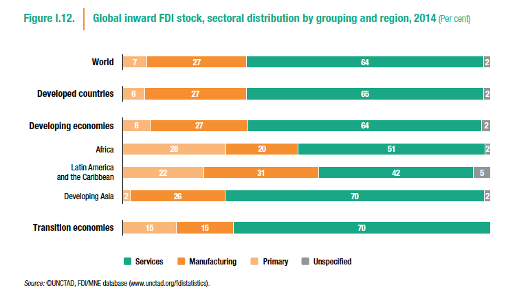
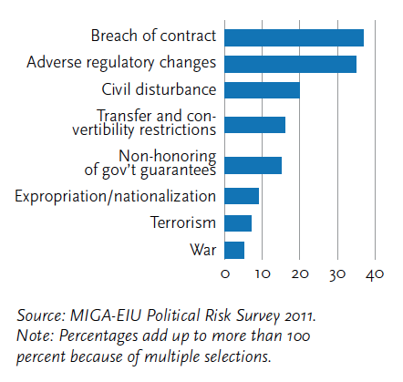
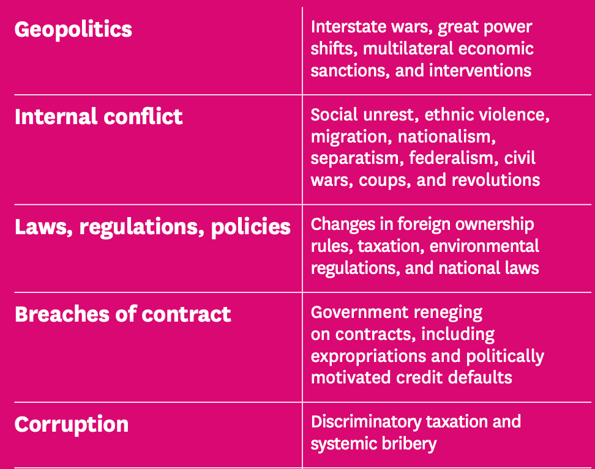

## Today's Plan

::: {.callout-important icon=false title="Today's Big Question"}
**What makes investing abroad politically risky — and why are extractive firms especially exposed to the government's change of heart?**
:::

<table class="plan-table">
<thead><tr><th>Section</th><th>What we'll cover</th></tr></thead>
<tbody>
<tr><td class="sec">1 · Extractives & risk</td><td>Why oil, gas, and mining live closest to the state</td></tr>
<tr><td class="sec">2 · The hold-up problem</td><td>Sunk costs, expropriation, and its history</td></tr>
<tr><td class="sec">3 · Bargaining models</td><td>The obsolescing bargain and political bargaining</td></tr>
<tr><td class="sec">4 · Widening the aperture</td><td>Newer political risks — and the case for responsible conduct</td></tr>
</tbody>
</table>

# Extractives & political risk {background-color="#990000"}

## Extractives and global business

::: {.columns}
::: {.column width="54%"}
- **Four of the top ten** MNEs by foreign assets are oil majors (Shell, Total, BP, ExxonMobil)
- Extraction requires a **close, ongoing relationship** with the host government
- The **resource curse** can make investment harder, not easier
:::
::: {.column width="46%"}
{fig-alt="Extractive multinationals among the largest firms by foreign assets" width="100%"}
:::
:::

## The "right" kind of governance

::: {.columns}
::: {.column width="50%"}
A host government that behaves like a **stationary bandit** — investing in rule of law and growth-promoting public goods — makes a far better long-term partner than a predatory one.
:::
::: {.column width="50%"}
{fig-alt="Stationary bandit and public goods provision" width="100%"}
:::
:::

# The hold-up problem {background-color="#990000"}

## The fundamental problem

- **Year 0:** a firm signs a contract with a government
- **Years 1–4:** it sinks large investment that **can't be redeployed** elsewhere
- **Year 5:** the government renegotiates in its favor — or simply **nationalizes**

## A history of expropriation

::: {.columns}
::: {.column width="55%"}
- **Pre-1913:** enforcement by force — colonialism, gunboat diplomacy
- **1920s–1970s:** economic nationalism, communism, decolonization — the *golden age of expropriation*
- **1980s–~2015:** neoliberalism and IFI-backed investment promotion — limited expropriation
:::
::: {.column width="45%"}
{fig-alt="Count of expropriations and reasons for MNE insurance claims" width="100%"}
:::
:::

# Bargaining models {background-color="#990000"}

## Obsolescing vs. political bargaining

::: {.columns}
::: {.column width="50%"}
**Obsolescing bargain**

MNE and government goals conflict (distributional; relative gains). The initial bargain **obsolesces** once the MNE sinks its investment and leverage shifts to the host.
:::
::: {.column width="50%"}
**Political bargaining**

Outcomes turn on each actor's **power resources**, which shift over time and across issues.
:::
:::

## "Good" governance makes investment less risky

Political stability · a well-run macroeconomy · rule of law · public goods (education, infrastructure, ports) · a sound regulatory environment (IP, trade, competition) · predictable tax policy.

# Widening the aperture {background-color="#990000"}

## Standard vs. newer political risks

{fig-alt="Widening the aperture of political risk — standard and newer concerns" width="62%"}

Beyond expropriation: reputational, social, environmental, and human-rights exposures now sit squarely inside "political risk."

## Discussion

How might these **new complexities** in political risk create a *business case* for socially responsible conduct?

## Key takeaways

- Extractive industries are historically central to MNE activity and must stay close to the government
- MNE–government bargaining is driven by **power resources that shift over time** — the obsolescing bargain
- "Good governance" lowers risk; widening risks make responsible conduct a strategic question, not just an ethical one

## Looking ahead

- **Wednesday (Day 7):** *Exxon in Aceh* — political risk, security forces, and corporate complicity

## Questions? {background-color="#990000"}

::: {.r-fit-text}
See you Wednesday.
:::
