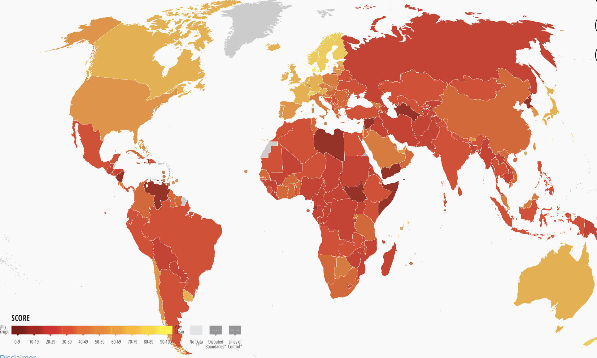

## Today's Plan

::: {.callout-important icon=false title="Today's Big Question"}
**If everyone knows corruption is costly, why is it so persistent — and what does it take to root out?**
:::

<table class="plan-table">
<thead><tr><th>Section</th><th>What we'll cover</th></tr></thead>
<tbody>
<tr><td class="sec">1 · What corruption is</td><td>Definitions, and why it's so hard to measure</td></tr>
<tr><td class="sec">2 · The collective-action trap</td><td>Why corruption persists even when all would prefer it gone</td></tr>
<tr><td class="sec">3 · Inside a firm</td><td>What made bribery pervasive at Siemens</td></tr>
<tr><td class="sec">4 · Looking ahead</td><td>Setting up Wednesday's Siemens write-up</td></tr>
</tbody>
</table>

# What corruption is {background-color="#990000"}

## Defining corruption

- **Corruption:** the misuse of publicly derived power for private gain
- **Bribery:** money or favors given to influence the acts of a public official — or anyone entrusted with power
- Forms differ: **grand vs. petty**, and **pervasive vs. arbitrary**

## Hard to measure

::: {.columns}
::: {.column width="48%"}
- **Hidden** by its very nature
- Qualitative differences: low-level vs. high-level; pervasiveness vs. arbitrariness
- Two main approaches: **perceptions** (e.g., the CPI) vs. **experience**
:::
::: {.column width="52%"}
{fig-alt="Transparency International Corruption Perceptions Index map" width="100%"}

[Source: Transparency International, Corruption Perceptions Index 2023]{.cite}
:::
:::

# The collective-action trap {background-color="#990000"}

## Corruption as a collective-action problem

Model two firms (or officials) choosing whether to **comply** or **cheat**:

| | B complies | B cheats |
|---|---|---|
| **A complies** | Best for society | A loses out |
| **A cheats** | A gets ahead | **Nash equilibrium** |

Everyone would prefer **[Comply, Comply]** — but absent enforcement, **[Cheat, Cheat]** is where they land. The whole challenge is engineering a credible move out of that box.

# Inside a firm: Siemens {background-color="#990000"}

## What made corruption pervasive at Siemens?

- **Weak leadership** and an enabling "tone at the top"
- **Limited compliance** enforcement resources
- A **changing legal environment** (FCPA, the OECD Anti-Bribery Convention, German law)
- **Global reach** across many jurisdictions and norms
- Intense **competitive pressure** to win contracts

## Key takeaways

- Corruption is the misuse of public power for private gain — persistent because it's a **collective-action problem**
- It's hard to measure; **perceptions are not the same as experience**
- Firm-level corruption is enabled by weak controls, competitive pressure, and global complexity

## Looking ahead

- **Wednesday (Day 9):** *Fighting Corruption at Siemens* — diagnose the causes and design a credible cleanup

## Questions? {background-color="#990000"}

::: {.r-fit-text}
See you Wednesday.
:::
