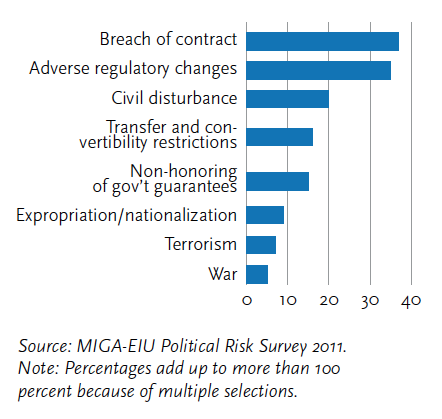

## Today's Plan

::: {.callout-important icon=false title="Today's Big Question"}
**Once a firm sinks billions into a foreign mine or factory, what stops the host government from changing the deal — and what recourse does the firm have?**
:::

<table class="plan-table">
<thead><tr><th>Section</th><th>What we'll cover</th></tr></thead>
<tbody>
<tr><td class="sec">1 · The hold-up problem</td><td>Why sunk, irreversible investments are vulnerable</td></tr>
<tr><td class="sec">2 · The obsolescing bargain</td><td>How bargaining power shifts after a firm enters</td></tr>
<tr><td class="sec">3 · Remedies</td><td>Political risk insurance, investment treaties, and ISDS</td></tr>
<tr><td class="sec">4 · The long arm of the law</td><td>How courts in one country reach conduct abroad — Jones &amp; Rahmani's "global regulation"</td></tr>
<tr><td class="sec">5 · The controversy</td><td>Why ISDS is contested — setting up Philip Morris</td></tr>
</tbody>
</table>

# The hold-up problem {background-color="#990000"}

## The fundamental problem

::: {.columns}
::: {.column width="54%"}
- **Year 0:** a firm signs a contract with a government
- **Years 1–4:** the firm sinks large, **irreversible** investment (a mine, a plant) that can't easily be redeployed
- **Year 5+:** once the costs are sunk, the government can change the terms — taxes, regulation, even **expropriation**
:::
::: {.column width="46%"}
{fig-alt="Types of political risk investors worry about most" width="100%"}

[Source: MIGA–EIU Political Risk Survey]{.cite}
:::
:::

# The obsolescing bargain {background-color="#990000"}

## How bargaining power shifts

- **Before entry:** the firm holds leverage — it can take its capital elsewhere
- **After entry:** leverage shifts to the host government — Vernon's **obsolescing bargain**
- The conflict is **distributional**: who captures the returns to the sunk investment (a focus on *relative* gains)

# Remedies {background-color="#990000"}

## Two ways to manage hold-up

::: {.columns}
::: {.column width="50%"}
**Political risk insurance**

- Costly, but can recoup ~90% of losses
- Subsidized by many rich countries and the **World Bank Group (MIGA)**
:::
::: {.column width="50%"}
**Investment treaties + ISDS**

- Bilateral investment treaties (BITs) grant investors the right to **arbitrate against host states** outside national courts
:::
:::

# The long arm of the law {background-color="#990000"}

## A different kind of remedy: courts, not just treaties

- ISDS lets **firms** sue **states**. But Jones & Rahmani (2022, "In Search of Global Regulation") describe the reverse move: courts and prosecutors in one country reaching **corporate conduct that happened somewhere else** — a private, litigation-driven substitute for the international regulation that doesn't fully exist
- Two mechanisms carry a lot of this weight: the U.S. **Alien Tort Statute (ATS/ATCA)**, letting foreign plaintiffs sue in U.S. courts for human-rights abuses connected to a U.S. defendant, and the U.S. **Foreign Corrupt Practices Act (FCPA)**, which lets U.S. authorities prosecute bribery of foreign officials even when the bribe itself happened abroad

## Connecting it to cases you already know

::: {.columns}
::: {.column width="52%"}
- **ATCA → Exxon in Aceh:** the ATS is exactly the legal theory Acehnese plaintiffs used to sue ExxonMobil in U.S. courts over abuses tied to the company's security arrangements — the case you read two weeks ago
- **FCPA → Siemens:** Siemens's bribery exposure and the reforms that followed were driven substantially by U.S. FCPA enforcement, even though the underlying bribery happened outside the U.S.
:::
::: {.column width="48%"}
- **ITT and Chile:** the classic historical precedent for extraterritorial "global regulation" of corporate political conduct — ITT's role in Chile's 1973 coup remains the textbook example political scientists reach for when they talk about firms trying to shape a host government's fate, and about how (and whether) accountability follows
:::
:::

## Why this belongs next to ISDS

- ISDS gives **firms** a remedy against **states**. ATCA/FCPA-style "global regulation" gives **someone else** — plaintiffs, prosecutors, another state's courts — a remedy against **firms**
- Both are attempts to patch the same gap: **there is no single global regulator**, so private litigation and extraterritorial law do some of that work instead
- Ask as you read: is this a fair substitute for a real international regulator, or does it just mean power follows whichever country's courts are willing to reach the furthest?

# The controversy {background-color="#990000"}

## Why ISDS is contested

- **Critics:** it can elevate investor rights above domestic regulation and produce **"regulatory chill"** on public-interest policy
- **Defenders:** it **depoliticizes** disputes and guards against genuine expropriation

## Key takeaways

- Sunk, irreversible investment creates a **hold-up problem**; bargaining power shifts to the host after entry
- **PRI** and **investment treaties/ISDS** are the main remedies
- ISDS trades investor protection against constraints on a state's **right to regulate**

## Looking ahead

- **Wednesday (Day 11):** *Philip Morris Asia v. Australia* — tobacco plain-packaging and the limits of ISDS

## Questions? {background-color="#990000"}

::: {.r-fit-text}
Thanks!
:::
