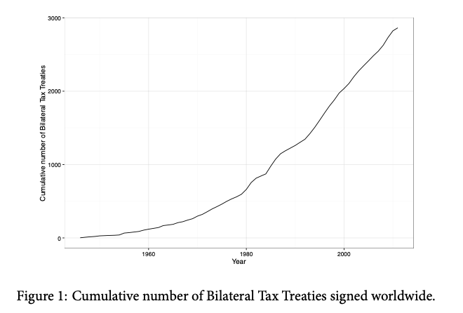
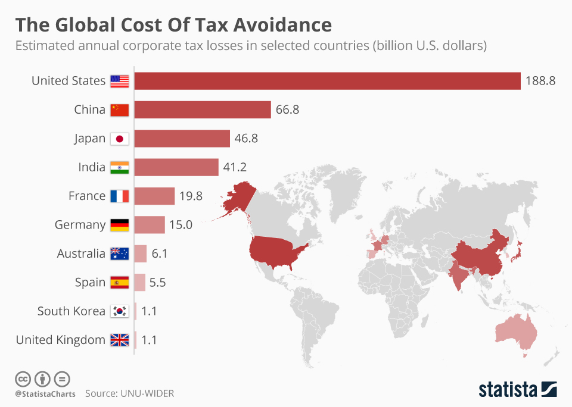
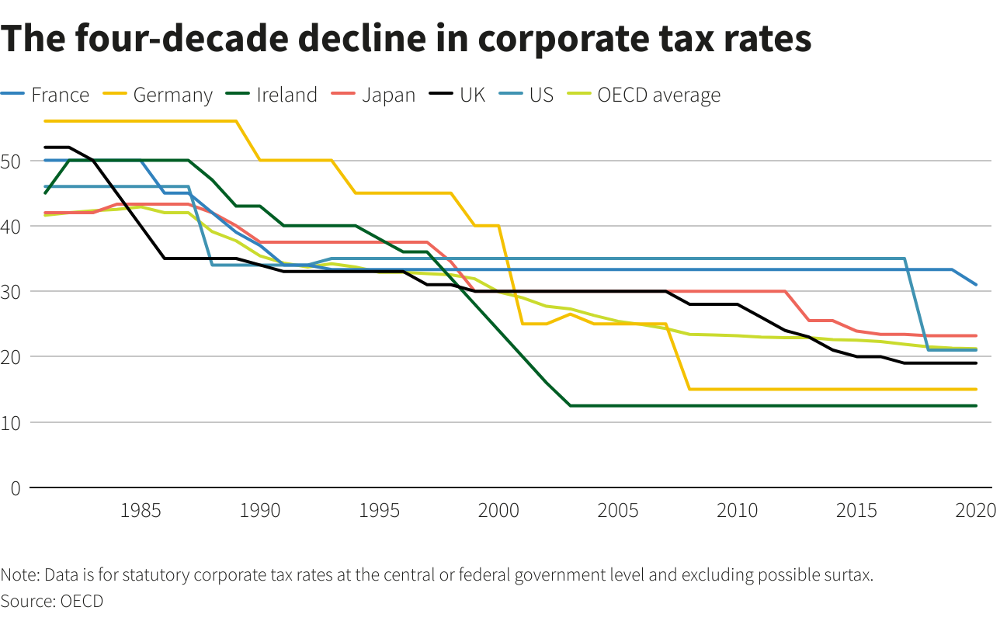
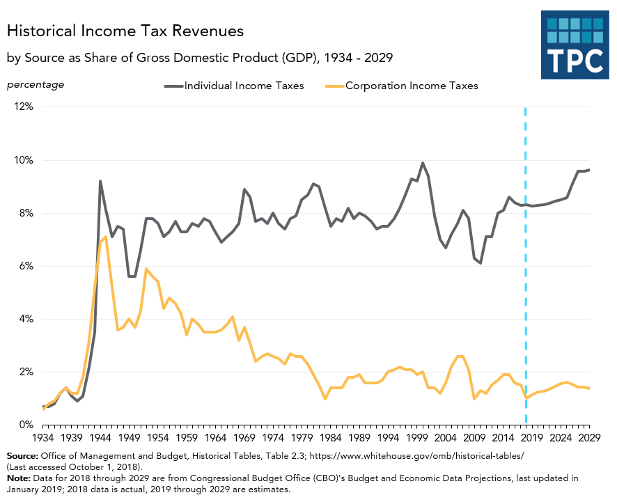

## Today's Plan

::: {.callout-important icon=false title="Today's Big Question"}
**Most corporate tax avoidance is perfectly legal. So why is it a problem — and can governments cooperate to stop a race to the bottom?**
:::

<table class="plan-table">
<thead><tr><th>Section</th><th>What we'll cover</th></tr></thead>
<tbody>
<tr><td class="sec">1 · The shift</td><td>From double taxation to double *non*-taxation</td></tr>
<tr><td class="sec">2 · The mechanics</td><td>BEPS, tax havens, and the Double Irish</td></tr>
<tr><td class="sec">3 · Why it matters</td><td>Who bears the cost when MNEs don't pay</td></tr>
<tr><td class="sec">4 · Solutions</td><td>Unitary taxation and the global minimum tax</td></tr>
</tbody>
</table>

# From double to double-non {background-color="#990000"}

## Two eras of the problem

::: {.columns}
::: {.column width="54%"}
- The old worry was **double taxation** — income taxed twice
- Today's worry is **double *non*-taxation** — profit taxed nowhere
- Tax is most effective when **automatically withheld**; that's why wage earners can't dodge it as easily as mobile capital can
:::
::: {.column width="46%"}
{fig-alt="Double taxation diagram" width="100%"}
:::
:::

## The size of the problem

::: {.columns}
::: {.column width="52%"}
- Estimated **$500–600 billion/year** in corporate tax losses
- **Mostly legal:** the arms-length, separate-entity system enables **Base Erosion and Profit Shifting (BEPS)** through transfer pricing
:::
::: {.column width="48%"}
{fig-alt="The scale of corporate tax avoidance" width="100%"}
:::
:::

# The mechanics {background-color="#990000"}

## Tax havens facilitate BEPS

- **Tax haven:** low/no corporate tax, easy incorporation, limited public disclosure
- No single list or definition — many are small island nations; within the U.S., **Delaware** often plays a similar role

## Race to the bottom

{fig-alt="Declining corporate tax rates — a race to the bottom" width="64%"}

Capital mobility makes **tax competition** consequential: each country has an incentive to undercut the others.

## The Double Irish Dutch Sandwich

A classic structure: the **corporate parent** books licensing revenue in a low-tax Irish entity, routes payments through a **Dutch** conduit to exploit tax treaties, and sells into Europe/MENA from there — leaving very little taxable profit anywhere.

# Why it matters {background-color="#990000"}

## Why tax avoidance is a problem

::: {.columns}
::: {.column width="54%"}
- **Premise:** taxes pay for public goods — infrastructure, security, a healthy and educated workforce
- It shifts the burden: **labor vs. capital**, and **MNEs vs. small business**
:::
::: {.column width="46%"}
{fig-alt="Distributional effects of tax avoidance" width="100%"}
:::
:::

# Solutions {background-color="#990000"}

## Potential solutions

- Shift from **arms-length/separate-entity** to a **unitary tax with formulary apportionment** (and the worldwide-vs-territorial debate)
- The **OECD global minimum tax (15%)** aims to turn tax competition from a **prisoner's dilemma** into a **stag hunt** — but only if enforcement is *incentive-compatible* so governments don't cheat by undercutting

## Where it stands now (2026)

- The **OECD/G20 Pillar Two 15% minimum tax** entered into force across many jurisdictions in 2024–25 (with a shifting U.S. posture)
- In **September 2024**, the **EU Court of Justice** ruled against Apple and Ireland — Apple owed roughly **€13 billion** in back taxes (the reverse of the earlier General Court decision)

## Key takeaways

- Most avoidance is **legal**, enabled by the arms-length system and tax havens
- It's a **collective-action problem** — a race to the bottom that cooperation could solve
- The minimum tax is the first serious attempt to change the game; enforcement is the open question

## Looking ahead

- **Wednesday (Day 15):** the *Apple–Ireland* case — sovereignty, state aid, and corporate power

## Questions? {background-color="#990000"}

::: {.r-fit-text}
See you Wednesday.
:::
