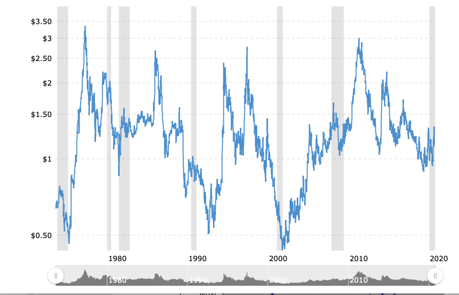
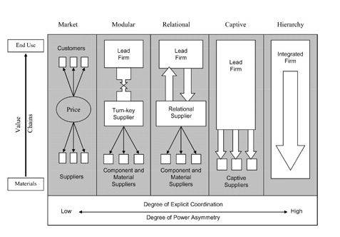

## Today's Plan

::: {.callout-important icon=false title="Today's Big Question"}
**When governments can't or won't discipline a global firm's supply chain, who else can — and does "who" change what actually gets fixed?**
:::

<table class="plan-table">
<thead><tr><th>Section</th><th>What we'll cover</th></tr></thead>
<tbody>
<tr><td class="sec">1 · Two mechanisms, one week</td><td>Advocacy/spotlighting vs. corporate self-regulation</td></tr>
<tr><td class="sec">2 · Power, authority, autonomy</td><td>Why firms are hard to discipline in the first place</td></tr>
<tr><td class="sec">3 · Advocacy networks</td><td>Keck & Sikkink, spotlighting, and Starbucks vs. Ethiopia (briefly)</td></tr>
<tr><td class="sec">4 · Chain governance & self-regulation</td><td>The Gereffi typology and why some firms regulate themselves</td></tr>
<tr><td class="sec">5 · Setting up Patagonia</td><td>What happens when a mission-driven firm audits itself — and still finds a problem</td></tr>
</tbody>
</table>

# Two mechanisms, one week {background-color="#990000"}

## A typology, not a list of cases

This is the first of two weeks asking the same underlying question from different angles: **who disciplines an MNE's supply chain when governments can't or won't?**

- **This week (private power):** outside pressure (advocacy/spotlighting) and inside pressure (corporate self-regulation) — two *private* mechanisms
- **In two weeks (public power):** government regulation, in the apparel/H&M case
- **Next week (a different face of public power):** tariffs and trade policy — governments regulating to protect *domestic industry*, not workers abroad. Don't conflate the two uses of "public regulation"

The growth of global value chains means MNEs are now **global institutions** orchestrating long supply chains — responsible for ~**80% of global trade** and ~**15% of all jobs** — while remaining **legally separated** from the suppliers that do the work. That separation is exactly what makes accountability hard, and exactly what today's two mechanisms try to work around.

# Power, authority, autonomy {background-color="#990000"}

## Why firms are hard to discipline

- **Power:** A's ability — through *instrumental* (e.g., lobbying), *structural*, or *discursive* means — to make B do something it otherwise wouldn't
- **Authority:** others' recognition of A's *right* to exercise that power
- **Autonomy:** A's ability to act independently of others' control

The configuration of a supply chain determines **where these accrue** — and thus whether anyone (a government, a consumer, a watchdog) can hold the lead firm to account.

# Advocacy networks {background-color="#990000"}

## A buyer-driven commodity chain: coffee

::: {.columns}
::: {.column width="52%"}
- Coffee is a **commodity** — undifferentiated, sold on a global market — and, like many agricultural commodities, a **buyer-driven** chain
- ~**80% of the market** is controlled by 5 brands that buy beans but don't grow them
:::
::: {.column width="48%"}
{fig-alt="World price of coffee fluctuates; growers capture little of final value" width="100%"}

[Growers capture little of the final value]{.cite}
:::
:::

## Keck & Sikkink: the spotlight

- **Transnational advocacy networks** mobilize information and moral pressure across borders, working through **spotlighting** — making a firm's conduct visible and costly to its brand
- **Brief illustration — Starbucks vs. Ethiopia (2006–07):** Ethiopia wanted to trademark its coffee-growing regions to capture more value for farmers; Starbucks initially resisted. A fair-trade advocacy campaign made the dispute costly to Starbucks's brand, and the two sides settled on a licensing deal
- The point isn't the specific outcome — it's the *mechanism*: would Ethiopia have had this leverage **without** an advocacy network willing to spotlight the dispute?

# Chain governance & self-regulation {background-color="#990000"}

## Five types of value-chain governance

::: {.columns}
::: {.column width="50%"}
- **Market:** low cost of switching partners
- **Modular:** suppliers make inputs with their own technology
- **Relational:** high trust, high asset specificity
- **Captive:** small suppliers dependent on large buyers
- **Hierarchy:** brought in-house
:::
::: {.column width="50%"}
{fig-alt="Gereffi typology of global value chain governance" width="100%"}

[After Gereffi, Humphrey & Sturgeon]{.cite}
:::
:::

Where a chain sits on this spectrum determines **how much leverage** the lead firm has — to enforce standards on suppliers, *or* to credibly claim it's monitoring them.

## When firms regulate themselves

- **CSR / self-regulation** is *private* regulation: not encoded in law, but created and enforced through a firm's own contracts, audits, and codes of conduct
- Villena & Gioia (2020) make the case that the real bottleneck isn't the firm's direct (Tier 1) suppliers — it's the **lower-tier suppliers** several links removed, who are hardest to see and hardest to audit
- Self-regulation's credibility problem: a firm is essentially **grading its own homework**. What would make you trust an audit a company runs on itself?

# Setting up Patagonia {background-color="#990000"}

## A hard test for self-regulation

Patagonia is arguably the **best-case scenario** for corporate self-regulation: a mission-driven firm, a founding member of the Fair Labor Association, a decade of supplier audits and codes of conduct — genuinely trying.

**And yet:** in 2019, despite all of that, Patagonia's own audits found **debt bondage among migrant workers** at a Tier 1 supplier — years after the company thought it had already solved this exact problem at its Tier 2 mills.

## Questions to carry into Wednesday

- If self-regulation fails even at the company trying hardest to make it work, what does that tell you about the other 99% of firms trying less hard?
- Where does **public** regulation (like California's transparency law) fit in — is it a backstop, or is it actually doing more of the work than it looks like?

## Looking ahead

- **Wednesday (Day 17):** *Patagonia — Tackling Human Trafficking in Global Supply Chains* — self-regulation's best case, tested

## Questions? {background-color="#990000"}

::: {.r-fit-text}
See you Wednesday.
:::
