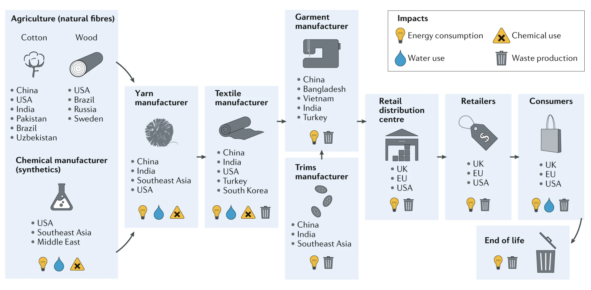
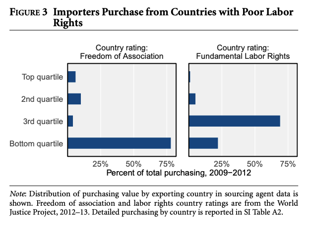
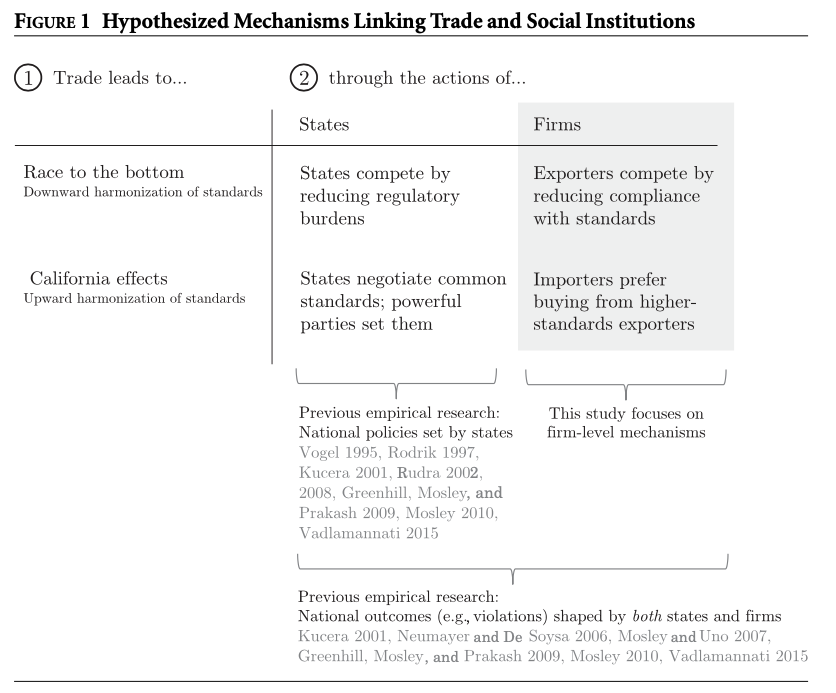

## Today's Plan

::: {.callout-important icon=false title="Today's Big Question"}
**Wealthy consumers, impoverished workers, and a chain of subcontractors no one fully controls — who can actually raise labor standards in global apparel?**
:::

<table class="plan-table">
<thead><tr><th>Section</th><th>What we'll cover</th></tr></thead>
<tbody>
<tr><td class="sec">1 · The apparel chain</td><td>Why it's complex and heavily subcontracted</td></tr>
<tr><td class="sec">2 · Rich consumers, poor labor</td><td>The gap the chain produces</td></tr>
<tr><td class="sec">3 · Race to the bottom</td><td>Collective-action dynamics in labor standards</td></tr>
<tr><td class="sec">4 · Does the evidence agree?</td><td>Distelhorst & Locke; advocacy and the boomerang</td></tr>
</tbody>
</table>

# The apparel chain {background-color="#990000"}

## Complex & subcontracted

::: {.columns}
::: {.column width="54%"}
Apparel production is **subcontracted** rather than internalized because the labor is largely **unspecialized** (not the same as unskilled), rarely involves trade secrets or IP, and doesn't require heavy fixed investment by the brand.
:::
::: {.column width="46%"}
{fig-alt="The complex, subcontracted apparel supply chain" width="100%"}
:::
:::

# Rich consumers, poor labor {background-color="#990000"}

## A structural gap

::: {.columns}
::: {.column width="50%"}
Apparel chains pair **wealthy consumers** at one end with **weak labor rights** at the other — the value and the working conditions sit in very different places.
:::
::: {.column width="50%"}
{fig-alt="Apparel supply chains and poor labor rights" width="100%"}
:::
:::

# Race to the bottom {background-color="#990000"}

## A collective-action problem

- Standards face the same **prisoner's-dilemma** dynamic as tax: all would prefer high standards, but each actor has an incentive to undercut
- Moving from **[Cheat, Cheat]** to **[Comply, Comply]** needs a channel: international agreements, industry accords, or advocacy pressure

## Does participation raise or lower standards?

{fig-alt="Does MNE supply-chain participation raise or lower social standards?" width="60%"}

Does joining an MNE supply chain **increase or decrease** social standards (human and labor rights)? The evidence is mixed — which is the puzzle Distelhorst & Locke take up.

# Does the evidence agree? {background-color="#990000"}

## Distelhorst & Locke (2018)

Read for the research design: **What is the question? Why does it matter? What data do they use? What do they find, and why does it matter?**

## TANs and the boomerang model

When is the **boomerang model** most likely to generate **spotlight effects** that raise standards? (Local actors bypass an unresponsive state by appealing to transnational allies who pressure from outside.)

## Key takeaways

- Apparel's subcontracted structure **diffuses responsibility** and weakens leverage over labor conditions
- Raising standards is a **collective-action problem** needing public, industry, or advocacy channels
- Whether supply-chain participation helps or harms workers is an **empirical** question — not settled by theory alone

## Looking ahead

- **Wednesday (Day 21):** *H&M, Rana Plaza, and Beyond* — who is responsible, and what should be done?

## Questions? {background-color="#990000"}

::: {.r-fit-text}
See you Wednesday.
:::
