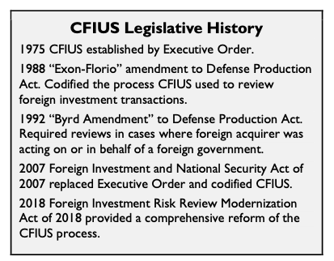
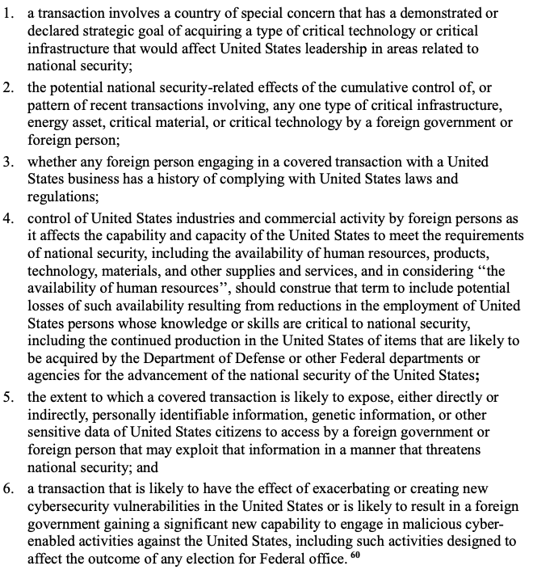
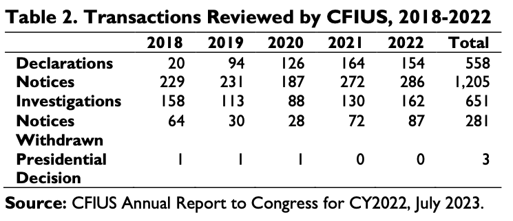
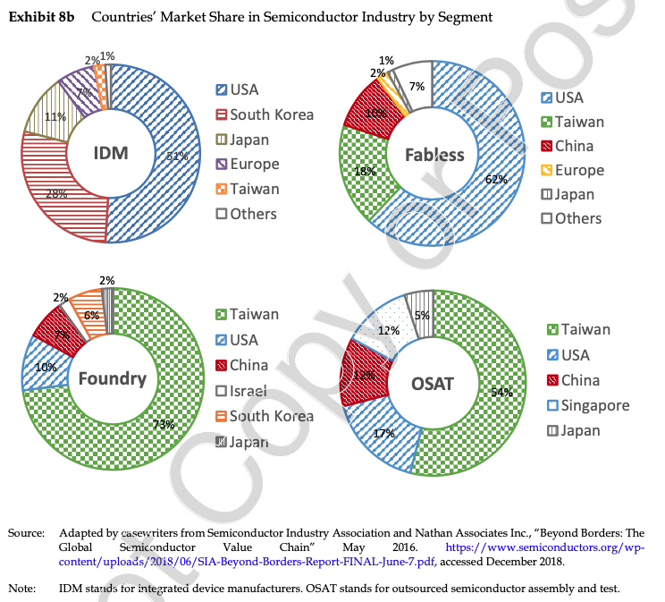

## Today's Plan

::: {.callout-important icon=false title="Today's Big Question"}
**When does foreign investment stop being just business and start being a national-security problem — and who gets to decide?**
:::

<table class="plan-table">
<thead><tr><th>Section</th><th>What we'll cover</th></tr></thead>
<tbody>
<tr><td class="sec">1 · Open, with guardrails</td><td>What CFIUS is — and isn't</td></tr>
<tr><td class="sec">2 · The legal test</td><td>When CFIUS can actually act</td></tr>
<tr><td class="sec">3 · A widening aperture</td><td>What now counts as "national security"</td></tr>
<tr><td class="sec">4 · Lattice & semiconductors</td><td>Strategic acquisitions and Made in China 2025</td></tr>
</tbody>
</table>

# Open, with guardrails {background-color="#990000"}

## What CFIUS is

::: {.columns}
::: {.column width="56%"}
- The **Committee on Foreign Investment in the United States** reviews foreign acquisitions of U.S. businesses for national-security risk
- The U.S. keeps an **open investment environment** — CFIUS is a *guardrail*, not a wall
- As developing economies (read: **China**) do more outward FDI, developed countries have grown more worried
:::
::: {.column width="44%"}
{fig-alt="CFIUS as guardrails on an open investment environment" width="100%"}
:::
:::

# The legal test {background-color="#990000"}

## When can CFIUS act?

CFIUS can intervene **only if**:

1. **No other law** is adequate to address the national-security threat, **and**
2. There is **credible evidence** the foreign investor might take action that threatens to **impair U.S. national security**

Remedies run from **mitigation agreements** and conditions up to **blocking** a deal or ordering **divestment**.

# A widening aperture {background-color="#990000"}

## What counts as national security?

::: {.columns}
::: {.column width="52%"}
The definition has **expanded well beyond defense** — now reaching:

- **Critical technology**
- **Critical infrastructure**
- **Sensitive personal data**
:::
::: {.column width="48%"}
{fig-alt="The widening definition of national security in investment review" width="100%"}
:::
:::

## Blocks are bipartisan

{fig-alt="Rising, bipartisan use of CFIUS blocks and mitigation" width="62%"}

Tightening foreign-investment review is one of the few areas of **sustained bipartisan agreement**.

# Lattice & semiconductors {background-color="#990000"}

## The Lattice Semiconductor case

::: {.columns}
::: {.column width="56%"}
- Chinese growth and **technological upgrading**, backed by industrial policy — **Made in China 2025** ($100–150B)
- **State-owned venture capital + SOEs** used to buy strategic Western assets, especially **semiconductors**
- A 2015–17 wave of attempted chip acquisitions; the **Lattice** deal was ultimately blocked
:::
::: {.column width="44%"}
{fig-alt="Strategic acquisitions to move up the semiconductor R&D chain" width="100%"}
:::
:::

## Why semiconductors?

Strategic acquisitions are central to competitiveness because the industry **consolidates as R&D costs rise** — as the technology matures, breakthroughs get harder and costlier, so buying capability can beat building it.

## Key takeaways

- CFIUS polices the line between **open investment** and **national-security risk**
- The bar to act is legally narrow, but the **definition of security keeps widening**
- Semiconductors show why **who owns critical technology** is now a security question

## Looking ahead

- **Wednesday (Day 23):** the *TikTok* case — data, algorithms, and forced divestiture

## Questions? {background-color="#990000"}

::: {.r-fit-text}
See you Wednesday.
:::
